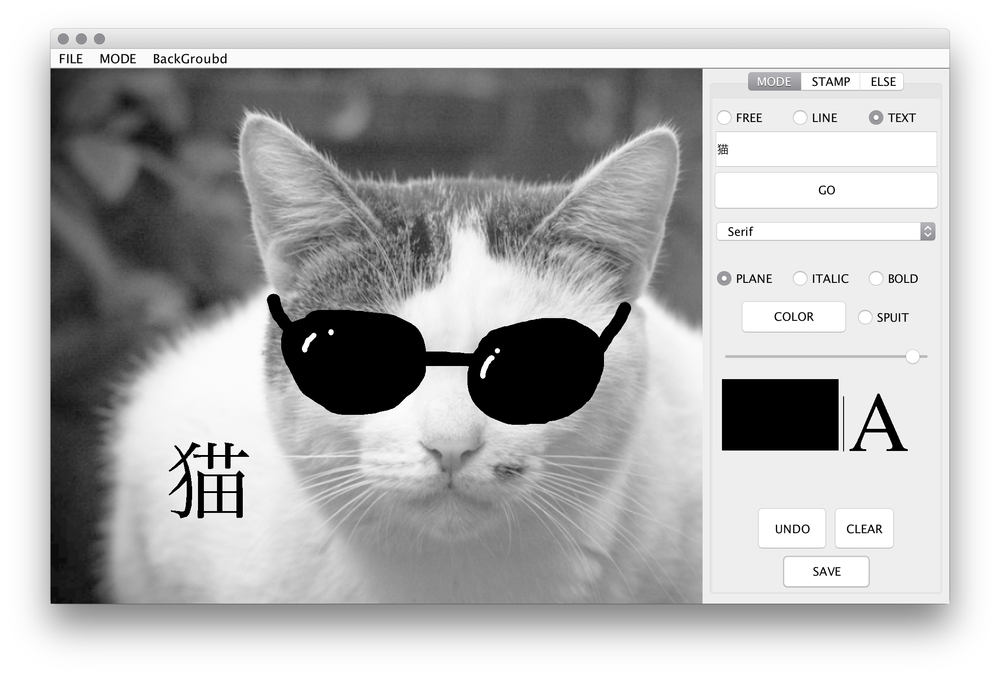

# javaのアプレットを使ってお絵描きツールを作る。
---

# 実行環境
* java version "9.0.4"
* コンパイルした後に、以下のコマンドで実行できる。
> java Drowing

# 出来上がったもの

## できること
---
* 線を自由に描く
* 線をまっすぐ描く
* 線の色を変える
* 線の太さを変える
* 任意の写真を読み込む(背景写真を消すこともできる)
* 写真サイズはウィンドウをカバーするように随時変化
* undo機能
* clear機能(確認ダイアログを表示)
* 描いたものを画像として任意の場所に保存する
* 文字の貼り付け
* 線と文字のプレビュー(色と太さ)
* ショートカットキー
* 任意のスタンプ貼り付け
* 背景の色を自由に変える
* new pageを作る
* 文字のFONT、太さ、斜めを変えれる
* スポイト機能

### 初期画面
左側のパネルが絵を描くところ、左側が操作パネルになっている。
  
MODEのFREEを選択することで自由に線を描くことができる。この時、線の色や大きさを変化させることが出来る。
  
LINEを選択することで直線を弾けるようになる。

TEXTを選択することで文字を晴れるようになる。こちらも色や大きさを変化させることが出来る。また、文字の字体もSerif, SansSerif, MonoSpacedから選ぶことが出来る。

また、操作パネルのタブをSTAMPにするとスタンプを貼ることが出来る。

タブをELSEにすると背景を帰ることが出来る。背景色を決めたり、背景に写真を読み込むことが出来る。

また、UNDOで何回も戻ることができたり、描いた物を保存することが出来る。また、色も選択するだけでなく、スポイト機能で色を選ぶ事ができる。
